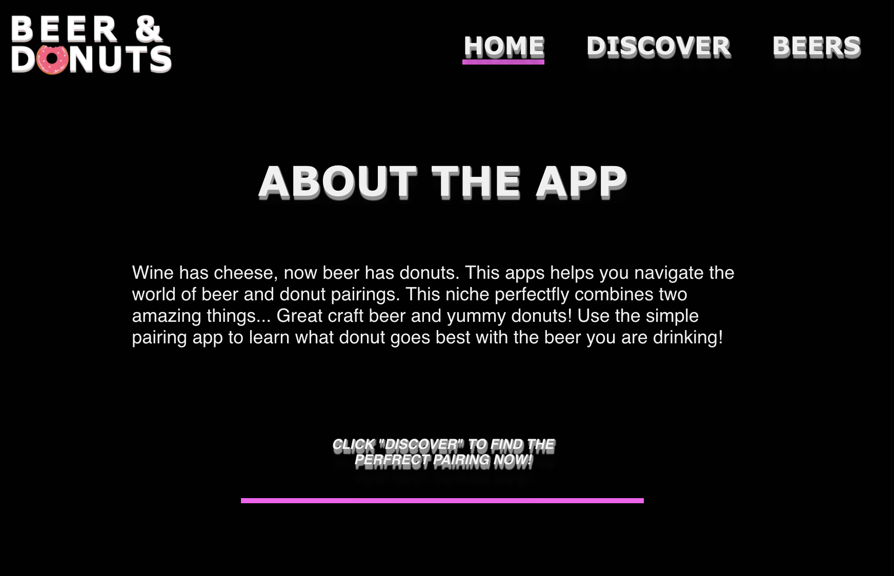
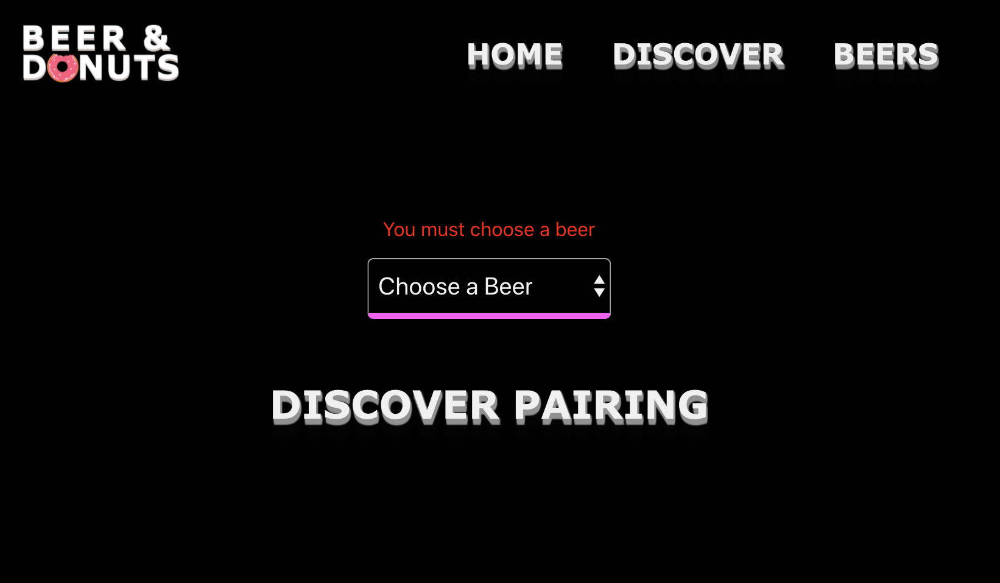
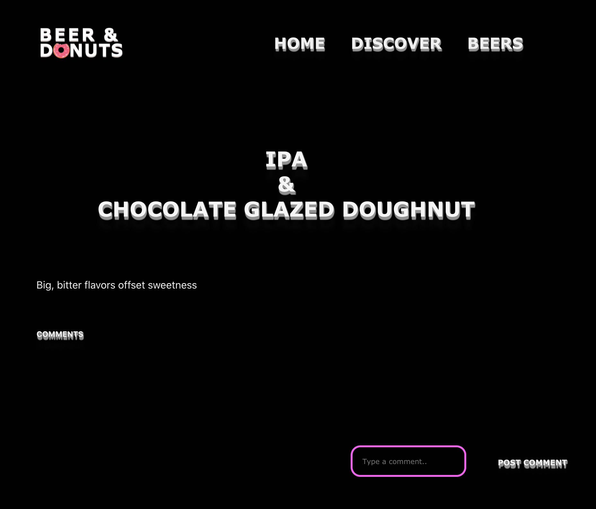
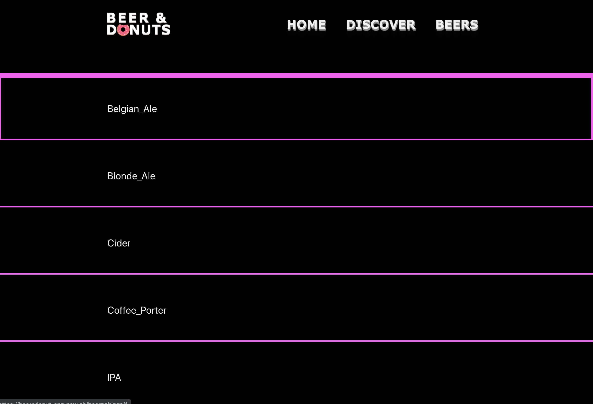

# Beer N' Donuts

### Summary
This apps helps you navigate the world of beer and donut pairings. 

### Screenshots

### Technology Used
FRONT END: HTML, CSS, JS, REACT

BACK END: NODE.JS, EXPRESS.JS, SQL

### Live Link
https://beerndonut-app.now.sh/

## Set up

Complete the following steps to start a new project (NEW-PROJECT-NAME):

1. Clone this repository to your local machine `git clone BOILERPLATE-URL NEW-PROJECTS-NAME`
2. `cd` into the cloned repository
3. Make a fresh start of the git history for this project with `rm -rf .git && git init`
4. Install the node dependencies `npm install`
5. Move the example Environment file to `.env` that will be ignored by git and read by the express server `mv example.env .env`
6. Edit the contents of the `package.json` to use NEW-PROJECT-NAME instead of `"name": "express-boilerplate",`

## Scripts

Start the application `npm start`

Start nodemon for the application `npm run dev`

Run the tests `npm test`

## Deploying

When your new project is ready for deployment, add a new Heroku application with `heroku create`. This will make a new git remote called "heroku" and you can then `npm run deploy` which will push to this remote's master branch.

## Access the API

### Beer Endpoints

#### GET /api/beerpairings
This will return the following information for each beer 

{
    id: '',
    style: '',
    tasting_notes: '',
    donut_pairing: ''
}

####  GET /api/beerpairings/:beerId
This will return the following information for the beer with the beerId 

{
    id: '',
    style: '',
    tasting_notes: '',
    donut_pairing: ''
}

### Comments Endpoints

#### POST /api/comments
This will let you post a comment to a specific beer.